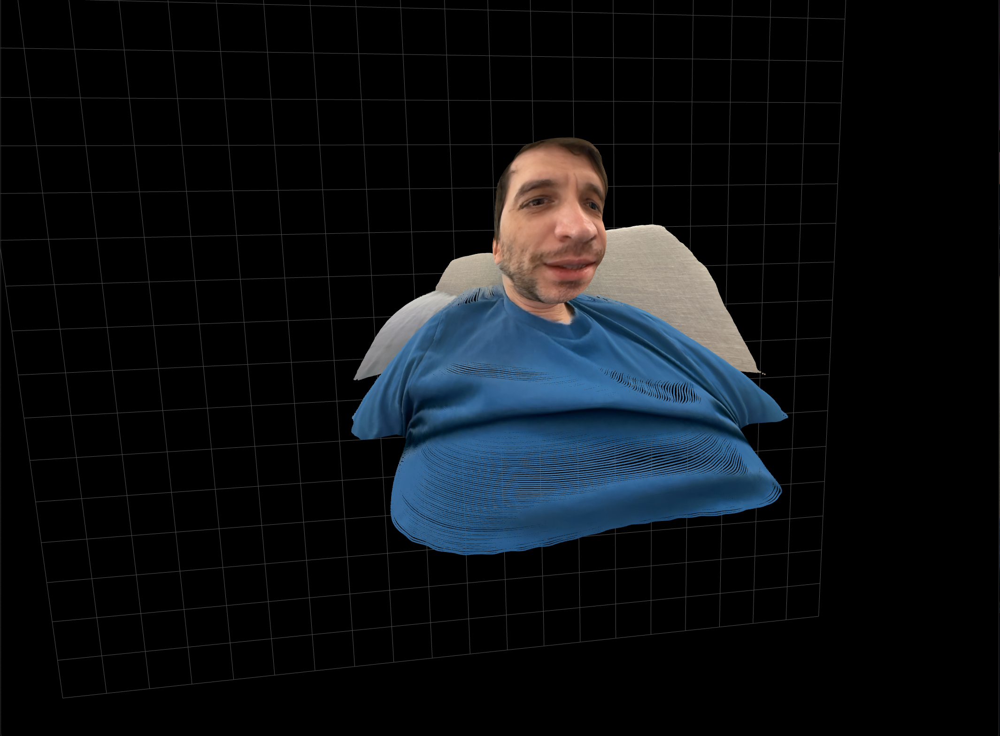

# Depth Cloud Hand Control

A Python application that converts standard 2D images (webcam or static) into 3D point clouds using advanced depth estimation. It features a real-time interactive mode where you can manipulate the 3D view using hand gestures.

## Features

-   **Real-time Point Cloud**: Converts webcam feed to 3D utilizing `Depth-Anything-V2`.
-   **Hand Gesture Control**: Manipulate the 3D view without a mouse:
    -   **Pan**: Open Palm + Move.

    -   **Rotate**: Fist + Move (XY).
    -   **Zoom**: Two Hands + Pinch In/Out.
-   **Static Image Tool**: Convert any photo into a 3D point cloud file (`.ply`).
-   **High Performance**: Optimized with Open3D visualization and PyTorch.

## Installation

This project uses `uv` for dependency management.

```bash
# Clone the repository
git clone <your-repo-url>
cd imageHandler

# Install dependencies
uv sync
```

## Usage

### 1. Real-time Webcam App




Run the main application:

```bash
uv run src/main.py
```

**Controls:**
-   **ESC**: Quit.
-   **R**: Reset View to center.
-   **C**: Toggle Color/Hologram Mode.
-   **I**: Toggle Depth Inversion (Fix Concave/Convex).
-   **B**: Toggle Motion Filter (Webcam only).
-   **Hand Gestures**:
    -   **Pan**: Open Palm + Move.
    -   **Rotate**: Fist + Move (XY).
    -   **Zoom**: Two Hands + Pinch In/Out.

**Options:**
-   `--camera <id>`: Select camera device (default: 0).
-   `--skip <n>`: Skip every N frames for depth estimation to improve FPS (default: 1).

### 2. Static Image Converter

Convert a single image to a point cloud:

```bash
uv run src/image_to_cloud.py path/to/image.jpg
# Optional: Save to file
uv run src/image_to_cloud.py image.jpg --save output.ply

# Optional: Adjust Field of View (0.5 = Wide, 1.0 = Narrow)
uv run src/image_to_cloud.py image.jpg --fov_scale 0.5
```

## Architecture

-   **MediaPipe**: High-speed hand tracking.
-   **Depth Anything**: State-of-the-art monocular depth estimation.
-   **Open3D**: Efficient 3D data visualization.
